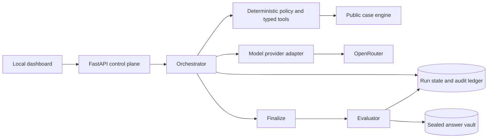

# MCS Investigation Lab

A local research platform for observing how independent AI investigators gather evidence, communicate, revise beliefs, and reach accusations in a controlled murder case. The project records the path to a conclusion, including incorrect paths, rather than treating a correct answer as the whole outcome.

## Start locally

Requires Python 3.11+ and [uv](https://docs.astral.sh/uv/).

```bash
uv sync --extra dev
uv run python -m lab.validate_case
MODEL_PROVIDER=mock uv run uvicorn lab.api:app --host 127.0.0.1 --port 8765
```

Open [http://127.0.0.1:8765](http://127.0.0.1:8765), then select **New investigation**. Mock mode is an explicitly labeled deterministic integration fixture. Its conclusions are not evidence of model capability.

## Run real investigators

Copy `.env.example` to `.env`, fill in an OpenRouter API key, and load it into your shell before starting the server:

```bash
set -a
source .env
set +a
./scripts/start-local.sh
```

Set `MODEL_PROVIDER=openrouter`, `OPENROUTER_API_KEY`, `INVESTIGATOR_MODEL`, and optionally `JEV_ENABLED=true` with `DECISION_MODEL=~typesafe/jev-latest`. The key remains server-side and `.env` is ignored by Git. The investigator model must support tool calling. The default model string is an example, so verify availability in your OpenRouter account. The provider adapter has contract tests and was smoke tested with OpenRouter's free tier; paid-model and Jev behavior still require account credits.

OpenRouter requires purchased credits for paid models and Jev. A key-level spending limit is not a credit balance. For a no-credit smoke test, use an explicit tool-capable free model such as `nex-agi/nex-n2.5-mini:free` and set `JEV_ENABLED=false`; free models may be rate limited or less reliable. Avoid the rotating `openrouter/free` alias for reproducible experiments because its underlying model can change between calls.

The default data store is `./lab.sqlite3`, outside Git. Delete that file only if you intentionally want to erase local experiments. A run is immutable through the application after finalization.

## What works

- One hand-authored eight-suspect case with 32 evidence items, a separately stored answer vault, and a case linter.
- Two or three lead investigators with bounded specialist creation and separate private evidence state.
- Typed investigation tools; no agent file, shell, HTTP, browser, database, or vault capability.
- Audited messages, findings, versioned hypotheses, independent accusations, deliberation, and final accusations.
- Persisted event replay, hash chaining, checkpoints, tail anchor, and verification.
- Post-finalization evaluation of culprit accuracy and six quality dimensions, plus observable wrong-theory drift.
- Live local dashboard for swarm, activity, communications, discovered evidence, suspects, hypotheses, consensus, replay, evaluation, influence graph, integrity, and run comparison.
- OpenRouter investigator adapter and optional Jev decision adapter behind one provider module.

## Architecture



SQLite was chosen instead of MongoDB for a zero-service local research environment with transactional storage and easy reproducibility. The database and answer vault are separate files. Investigators never receive direct database or file access. See [architecture](docs/ARCHITECTURE.md), [threat model](docs/SECURITY.md), [agent protocol](docs/PROTOCOL.md), and [evaluation methodology](docs/EVALUATION.md).

## Configuration

| Variable | Purpose | Default |
| --- | --- | --- |
| `MODEL_PROVIDER` | `mock` fixture or `openrouter` real inference | `mock` |
| `OPENROUTER_API_KEY` | Server-only OpenRouter credential | empty |
| `INVESTIGATOR_MODEL` | OpenRouter tool-calling model | `google/gemini-3-flash-preview` |
| `DECISION_MODEL` | Jev decision model | `~typesafe/jev-latest` |
| `JEV_ENABLED` | Ask Jev for advisory next-action choices | `false` |
| `DATABASE_PATH` | Local SQLite data path | `./lab.sqlite3` |
| `MAX_MODEL_CALLS` | Per-run inference-request cap | `90` |
| `MAX_TOOL_CALLS_PER_AGENT` | Per-agent action cap | `24` |
| `MAX_TOTAL_AGENTS` | Per-run agent cap | `9` |
| `MAX_WORKERS_PER_LEAD` | Per-lead worker cap | `2` |
| `MAX_DELEGATION_DEPTH` | Lead is depth 0 | `2` |
| `MAX_COST_USD` | Stop new investigator turns when reported cost reaches cap | `5` |

OpenRouter's [tool-calling documentation](https://openrouter.ai/docs/guides/features/tool-calling) describes the investigator request shape. Jev uses a [typed Choice](https://docs.typesafe.ai/primitives/choice) through OpenRouter's decisions endpoint. Jev recommendations are advisory; deterministic policy remains the only authorization decision maker.

## Tests and experiment workflow

```bash
uv run ruff check .
uv run pytest -q
node --check lab/static/app.js
uv run python -m lab.validate_case
```

Start one mock run first to verify your environment. Then change the provider and model settings, restart the server, and launch a fresh run. Each run stores the exact case hash, model configuration, tool/prompt/scoring versions, Git commit when available, event trace, token metadata, and returned cost. Use **Compare runs** to inspect completed runs on the same case. The HTTP API is documented at `/api/docs`. Useful local endpoints are `/api/health`, `/api/case`, `/api/runs`, `/api/compare`, and `/api/runs/{run_id}`.

## Current limits

This is a **local research prototype**. Keep it bound to `127.0.0.1`: there is no user authentication, TLS, separate vault process identity, or production multi-tenant isolation. A host administrator who can alter both the database and its anchors can rewrite history. The scoring rubric is deterministic and transparent but approximates narrative quality using citations and terms; it is not a human adjudicator. The investigator loop uses bounded sequential turns, and provider errors can leave an agent without an accusation rather than fabricating one. OpenRouter's returned usage/cost data may be incomplete, so `MAX_COST_USD` alone is not a guaranteed billing cap; use an OpenRouter key-level spending limit as well.
