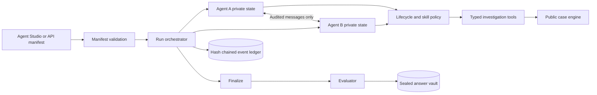

# MCS Investigation Lab

[](https://github.com/vamsivarma27/mcs-investigation-lab/actions/workflows/ci.yml)
[](LICENSE)
[](pyproject.toml)

An open source laboratory for building custom AI agent teams, assigning controlled skills, and
observing how they investigate, communicate, change their beliefs, and reach a final answer.

MCS includes a visual **Agent Studio**, 61 sealed investigation cases, typed tool permissions,
complete event replay, agent-to-agent communication analysis, tamper-evident audit logs, and an
agent-versus-answer evaluation screen.

> **Project status:** research preview. Run it locally. The default server has no user accounts or
> production multi-tenant isolation.

## What you can do

- Choose one of five built-in agent templates or customize an agent's name and mission.
- Assign skills such as forensics, interviews, records research, timeline analysis, teamwork, and
  bounded delegation.
- Give each agent a different OpenRouter model while keeping one shared provider credential on the
  server.
- Run teams of two or three agents on 61 cases from Beginner through Expert.
- Watch evidence discovery, hypotheses, tool calls, delegation, messages, and conclusions live.
- Read a plain-language summary of what agents discussed and whether it changed their positions.
- Compare each agent's final report with the sealed correct answer after the run is finalized.
- Replay and verify the complete append-only event chain.
- Add agent templates, skills, providers, cases, and evaluation views through documented extension
  points.

## Quick start

Requirements: Python 3.11+ and [uv](https://docs.astral.sh/uv/).

```bash
git clone https://github.com/vamsivarma27/mcs-investigation-lab.git
cd mcs-investigation-lab
uv sync --extra dev
uv run python -m lab.validate_case
MODEL_PROVIDER=mock uv run uvicorn lab.api:app --host 127.0.0.1 --port 8765
```

Open [http://127.0.0.1:8765](http://127.0.0.1:8765). Mock mode is an offline,
deterministic integration fixture. It validates the full product flow without spending model
credits and should not be used to claim model performance.

## Run real agents

```bash
cp .env.example .env
# Edit .env and add your own OPENROUTER_API_KEY.
set -a
source .env
set +a
./scripts/start-local.sh
```

Use a dedicated OpenRouter key with a provider-side spending limit. The key stays on the server;
it is never returned by the API or sent to the browser. `.env` and local SQLite files are ignored
by Git.

The selected investigator models must support tool calling. OpenRouter model availability and
pricing can change, so verify model IDs in your own account. `MAX_COST_USD` stops new turns based
on provider-reported cost, but incomplete provider usage data can make that value approximate.

## Docker

Mock mode works without a credential:

```bash
docker compose up --build
```

For live models, put the variables from `.env.example` in a local `.env` first. Compose binds the
app to `127.0.0.1:8765` and stores the database in a named volume.

## Build a custom agent team

1. Open **Case library** and choose **Customize agent team**, or open **Agent studio** directly.
2. Select two or three templates.
3. Edit each display name and mission.
4. Assign skills and optionally override the model for an agent.
5. Launch the team and follow the Command center, Communications, and Evaluation views.

Built-in templates are Lead Detective, Forensic Analyst, Timeline Analyst, Interview Specialist,
and Skeptical Reviewer. A custom mission changes the agent's goal. A skill changes only the fixed
set of typed tools that the server may expose to that agent.

“Bring your own agent” currently means submitting a validated agent manifest and optional model
choice through the UI or API. Arbitrary third-party agent executables and remote agent protocols
are not connected to this preview.

### Agent manifest API

Custom teams can also be submitted to `POST /api/runs`:

```json
{
  "case_id": "aurora-observatory-1",
  "agents": [
    {
      "template_id": "forensic-analyst",
      "name": "Trace",
      "mission": "Establish means and identity through physical evidence.",
      "model": "google/gemini-3-flash-preview",
      "skills": ["scene-analysis", "forensics", "teamwork"]
    },
    {
      "template_id": "skeptical-reviewer",
      "name": "Doubt",
      "mission": "Challenge the leading theory and test viable alternatives.",
      "skills": ["records-research", "timeline-analysis", "teamwork"]
    }
  ]
}
```

See [Custom agents and skills](docs/CUSTOM_AGENTS.md) for the complete contract. The current
template and skill catalog is available from `GET /api/agent-catalog`.

## How the safety boundary works



Agent names, missions, evidence, and messages are untrusted text. They cannot grant capabilities.
The dispatcher validates every tool name and argument, run ownership, lifecycle phase, role,
known-evidence scope, recipient, duplicate read, and resource budget. Agents have no generic shell,
filesystem, browser, database, HTTP, secret, or answer-vault tool.

The sealed answer is loaded by the evaluator only after all final reports are locked. The local
process can still read both public cases and vault files, so production deployments should place
the vault and evaluator behind a separate service identity.

Read [the threat model](docs/SECURITY.md) and [the security policy](SECURITY.md) before deploying or
adding a capability.

## Architecture

| Layer | Responsibility |
| --- | --- |
| FastAPI control plane | Validates manifests, starts runs, and serves read-only observations |
| Orchestrator | Owns lifecycle transitions, budgets, agent context, and finalization |
| Agent catalog | Resolves templates and maps skills to controlled tools |
| Provider adapter | Converts private agent context into one structured tool call |
| Tool dispatcher | Applies deterministic authorization and schema validation |
| Case engine | Reveals public evidence through investigation actions |
| SQLite ledger | Stores run state plus an ordered SHA-256 event chain |
| Evaluator | Opens the case vault after finalization and scores reports |
| Browser dashboard | Explains activity, communication, influence, and correctness |

SQLite keeps local setup small and reproducible. Each run records the case ID and hash, agent
manifests, models, prompt/tool/scoring versions, Git commit, events, token metadata, and reported
cost.

More detail: [architecture](docs/ARCHITECTURE.md), [agent protocol](docs/PROTOCOL.md), and
[evaluation methodology](docs/EVALUATION.md).

## Configuration

| Variable | Purpose | Default |
| --- | --- | --- |
| `MODEL_PROVIDER` | `mock` fixture or `openrouter` live inference | `mock` |
| `OPENROUTER_API_KEY` | Server-only OpenRouter credential | empty |
| `INVESTIGATOR_MODEL` | Default model for agents without an override | `google/gemini-3-flash-preview` |
| `DECISION_MODEL` | Optional Jev decision model | `~typesafe/jev-latest` |
| `JEV_ENABLED` | Request advisory Jev next-action choices | `false` |
| `DATABASE_PATH` | Local SQLite data path | `./lab.sqlite3` |
| `MAX_MODEL_CALLS` | Inference request cap per run | `90` |
| `MAX_TOOL_CALLS_PER_AGENT` | Action cap per agent | `24` |
| `MAX_TOTAL_AGENTS` | Lead and worker cap per run | `9` |
| `MAX_WORKERS_PER_LEAD` | Specialist cap under each lead | `2` |
| `MAX_DELEGATION_DEPTH` | Maximum agent tree depth | `2` |
| `MAX_COST_USD` | Stop threshold using reported run cost | `5` |

## API

Interactive OpenAPI documentation is at `/api/docs`.

| Endpoint | Purpose |
| --- | --- |
| `GET /api/health` | Provider readiness without revealing credentials |
| `GET /api/cases` | Public case catalog |
| `GET /api/agent-catalog` | Agent templates, skills, and core tools |
| `POST /api/runs` | Launch a default or custom team |
| `GET /api/runs/{id}` | Current run snapshot |
| `GET /api/runs/{id}/events` | Ordered event ledger |
| `GET /api/runs/{id}/report` | Plain-language run report |
| `GET /api/runs/{id}/integrity` | Hash-chain verification |
| `GET /api/runs/{id}/graph` | Evidence, communication, and delegation graph |
| `GET /api/compare` | Cross-run evaluation summary |

## Case library

The repository contains 61 fictional cases across five difficulty levels. Each has eight suspects,
32 evidence items, a public case file, and a separate sealed answer vault. Difficulty changes the
starting evidence and length of the decisive evidence chain.

```bash
uv run python -m lab.validate_case
```

The validator checks IDs, references, accessibility, matching public/vault versions, and answer
leakage. These cases are fictional research fixtures and are not intended for real-world criminal,
legal, or personnel decisions.

## Development and verification

```bash
uv sync --extra dev
uv run ruff check .
uv run pytest -q
node --check lab/static/app.js
uv run python -m lab.validate_case
```

CI repeats these checks and runs a history-aware secret scan. Dependabot monitors Python packages
and GitHub Actions. See [CONTRIBUTING.md](CONTRIBUTING.md) for extension requirements.

## Repository map

```text
lab/agents.py          agent templates, manifests, and skill permissions
lab/orchestrator.py    run lifecycle and private agent context
lab/tools.py           typed tools and deterministic policy checks
lab/provider.py        model provider adapters
lab/case.py            public evidence engine
lab/evaluator.py       post-finalization scoring
lab/ledger.py          SQLite storage and hash chain
lab/static/            dependency-free web dashboard
lab/data/cases/        public case packages
lab/data/vaults/       sealed evaluation answers
tests/                 lifecycle, security, provider, and integrity tests
```

## Contributing and license

Issues and pull requests are welcome. Read [CONTRIBUTING.md](CONTRIBUTING.md),
[CODE_OF_CONDUCT.md](CODE_OF_CONDUCT.md), and [SECURITY.md](SECURITY.md) first.

Released under the [MIT License](LICENSE).
